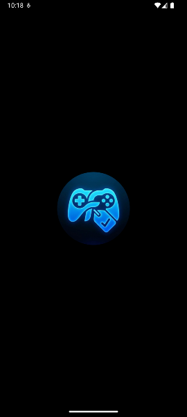
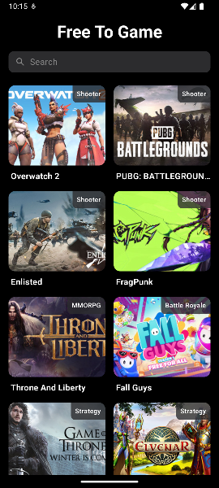
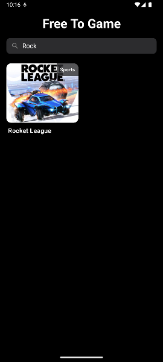
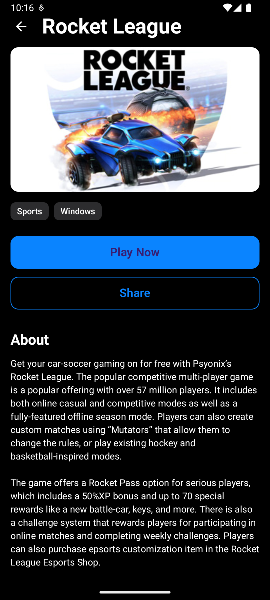
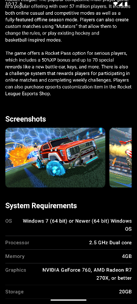
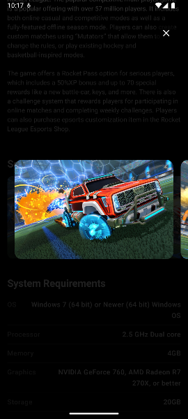

# 🎮 FreeToGame Android App


Android geliştirme yeteneklerimi geliştirmek ve modern teknolojileri (Jetpack Compose, MVVM) öğrenmek amacıyla yaptığım bir oyun keşif uygulaması.

Bu projede **FreeToGame API** kullanarak güncel ücretsiz oyunları listeliyorum. Hem tasarım hem de kod yapısı olarak temiz ve düzenli bir iş çıkarmaya çalıştım.

## 📱 Uygulama Görüntüleri

| Açılış Ekranı | Oyun Listesi | Arama Ekranı |
|:---:|:---:|:---:|
|  |  |  |

| Oyun Detayı | Sistem Özellikleri | Galeri Modu |
|:---:|:---:|:---:|
|  |  |  |

## ✨ Neler Yaptım?

* **Oyun Listesi:** İnternetten çektiğim oyunları kaydırılabilir bir liste halinde gösterdim.
* **Arama Yapma:** İstediğiniz oyunu ismine göre hızlıca bulabiliyorsunuz.
* **Detay Sayfası:** Oyunun konusu, yapımcısı ve çıkış tarihi gibi bilgileri burada gösterdim.
* **Resim Galerisi:** Oyun içi görüntüler için sağa-sola kaydırılabilir güzel bir galeri ekledim.
* **Sistem Gereksinimleri:** Oyunun bilgisayarda çalışması için gereken özellikleri listeledim.
* **Karanlık Mod:** Uygulama tamamen koyu tema (Dark Mode) ile çalışıyor.

## 🛠 Kullandığım Teknolojiler

Projeyi geliştirirken Android dünyasında popüler olan güncel araçları kullandım:

* **Dil:** Kotlin
* **Tasarım:** Jetpack Compose (Material 3)
* **Mimari:** MVVM (Kodları düzenli tutmak için)
* **İnternet Bağlantısı:** Retrofit & OkHttp
* **Resim Yükleme:** Coil
* **Asenkron İşlemler:** Coroutines & Flow
* **Veri Dönüştürme:** Gson

## 🏗 Proje Yapısı Hakkında

Kodların karışmaması için **MVVM** yapısını kullandım.
* **Data:** İnternetten verileri çeken kısım.
* **Domain:** Uygulamanın kullandığı veri modelleri.
* **UI:** Ekranda görünen tasarımlar.

## 🚀 Çalıştırma

Projeyi denemek isterseniz:

1.  Repoyu indirin:
    ```bash
    git clone [https://github.com/ugurrdev/FreeToGame.git](https://github.com/ugurrdev/FreeToGame.git)
    ```
2.  **Android Studio** ile açın.
3.  Yüklemelerin bitmesini bekleyip **Run** tuşuna basın.
